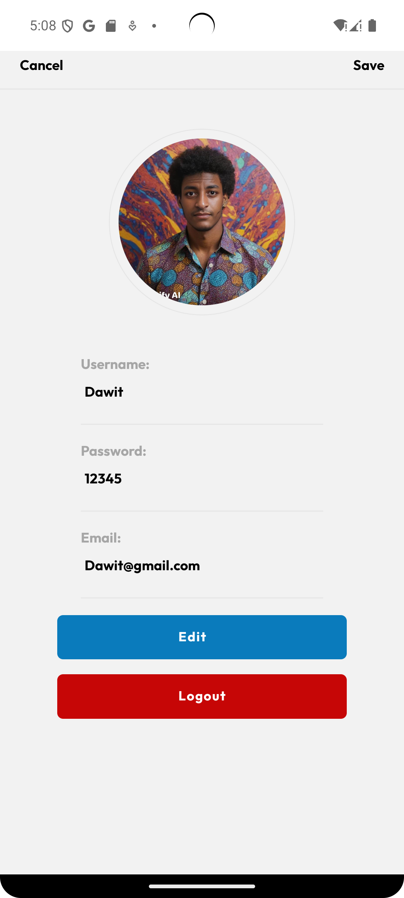

# 🍔 Online Food Order App

A modern and responsive **Online Food Ordering Android App** built with **React Native**.  
This app provides a seamless user experience for browsing food items, viewing details, adding to cart, and placing orders—all in one place. Designed with an intuitive UI/UX to enhance usability and visual appeal.

---

## 🛠️ Tech Stack

- **React Native**
- **JavaScript**
- **Android Studio Emulator**
- **Custom UI Design**

---

## 🎨 UI/UX Screens (9 Total)

## ✅ Features

- Add/remove food items to/from cart
- Adjust quantity dynamically
- Real-time total updates
- Clean and modern UI
- Fully responsive mobile design

---
